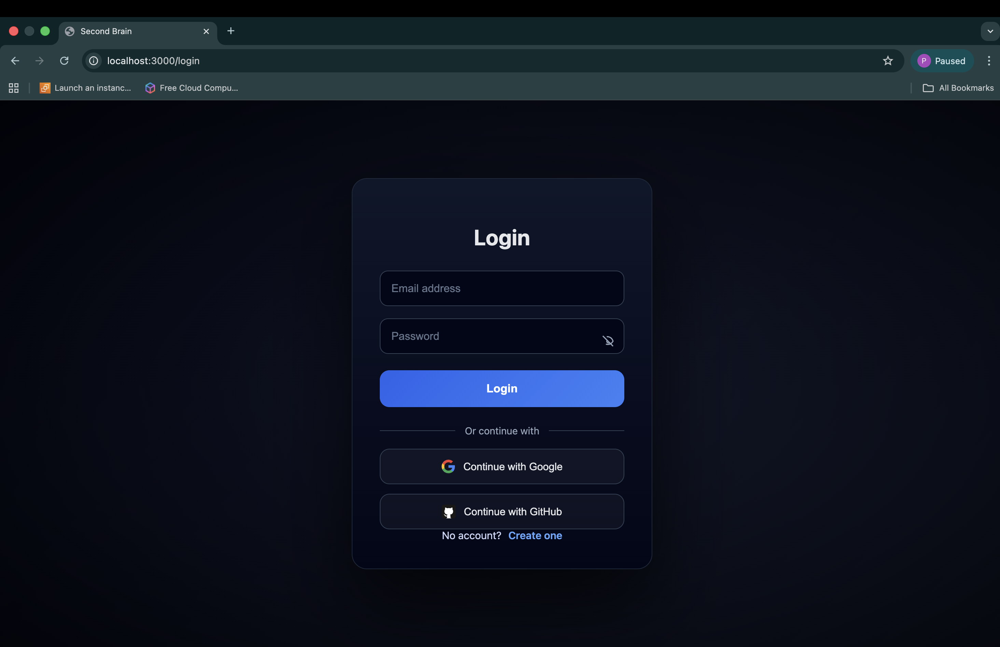
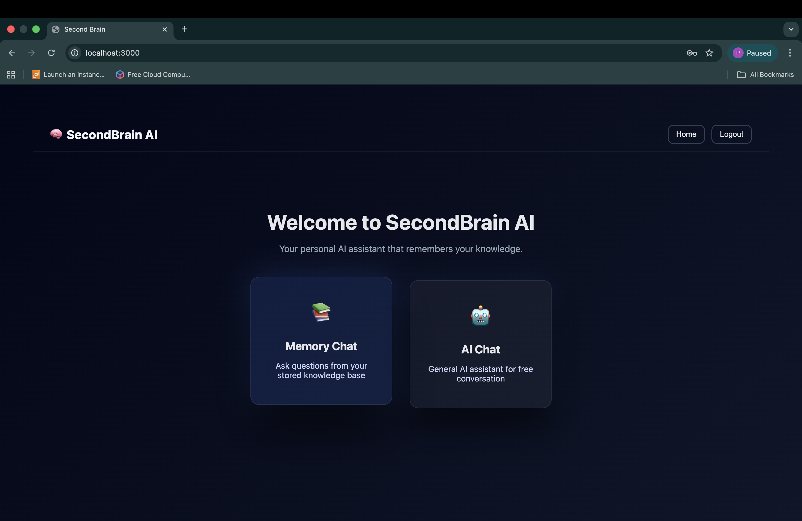
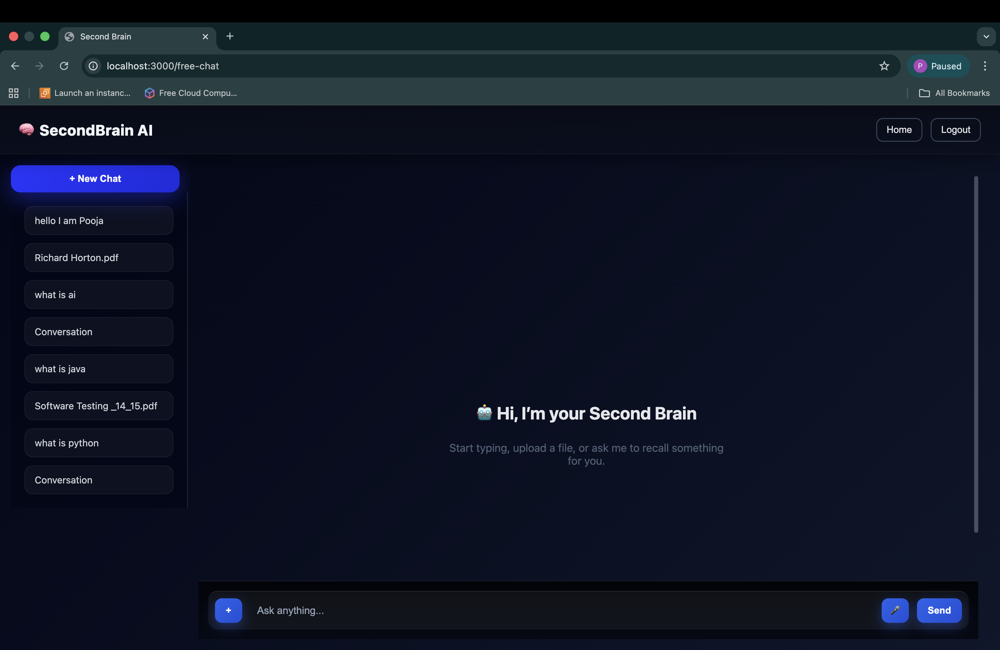
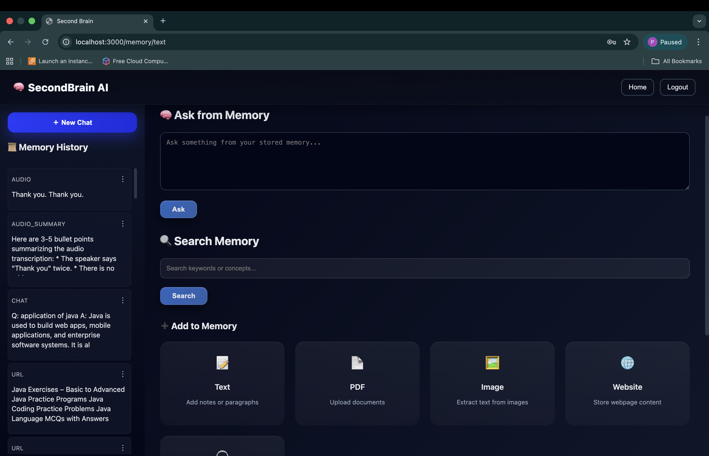
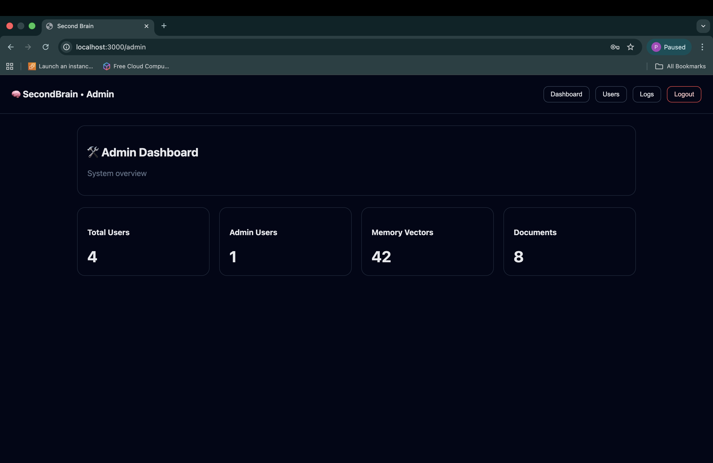

# 🧠 Second Brain – AI-Powered Knowledge Assistant

Second Brain is a **full-stack AI-powered memory and knowledge assistant**.  
It allows users to chat with AI, upload documents, images, audio, and URLs, store them as personal memory, and later **search, recall, and reason over their own data**.

It acts as your personal **“second brain”** to store and interact with knowledge using AI.

---

## 📌 Purpose of the Project

The purpose of this project is to build an intelligent system that helps users **store, organize, and interact with personal knowledge** using modern AI models and vector search.

The application is designed to be:
- Scalable
- Secure
- Fast
- Memory-efficient
- Developer-friendly

---

## 🛠️ Tech Stack

### Frontend


### Backend


### Databases


### AI & APIs


### Infrastructure


---

## ✨ Features

- 🔹 AI Chat (Streaming) – Real-time chat with AI models
- 🔹 Memory System – Store and retrieve personal knowledge
- 🔹 PDF Upload & Chat – Ask questions from uploaded PDFs
- 🔹 Image Understanding – Upload images and ask questions
- 🔹 Audio Ingestion – Upload audio files and process them
- 🔹 URL Ingestion – Save and understand website content
- 🔹 Hybrid Search – Keyword + semantic search over memory
- 🔹 Authentication – Secure JWT-based login & signup
- 🔹 Chat Sessions – Persistent chat history
- 🔹 Admin APIs – User and system analytics
- 🔹 Fully Dockerized – Frontend + Backend + Databases

---

## 🏗️ Architecture

The **Second Brain** application follows a modular, service-oriented architecture:

- **Frontend (React + Vite)**  
  Handles UI, authentication, chat streaming, and file uploads.

- **Backend (FastAPI)**  
  Manages authentication, ingestion pipelines, embeddings, memory logic, and AI interaction.

- **Vector Database (Qdrant)**  
  Stores embeddings for semantic and hybrid search.

- **Relational Database (PostgreSQL)**  
  Stores users, chat sessions, messages

- **AI Layer**  
  Uses Groq / OpenAI APIs for reasoning and responses.

---

## ⚙️ How It Works

1. Files, chats, images, and URLs are converted into embeddings
2. Embeddings are stored in **Qdrant vector database**
3. User queries trigger **semantic + hybrid search**
4. Relevant memory is retrieved
5. AI model generates answers using personal context
6. Chats and users are stored in **PostgreSQL**

---

## ▶️ Run Locally

### Backend
```bash
cd backend
python -m venv venv
source venv/bin/activate      # Mac/Linux
venv\Scripts\activate         # Windows

pip install -r requirements.txt
uvicorn app.main:app --reload

### Backend
cd frontend/second-brain-frontend
npm install
npm run dev


## ▶️ Run with Docker

# Run with Docker
docker compose down -v
docker compose build --no-cache
docker compose up

Then open : http://localhost:3000

---

<hr style="border: 1px solid white; margin-top: 20px;">

<h1 style="color:#1E90FF;">UI Screenshots</h1>

<h3 style="color:#1E90FF;">Login Page</h3>


<h3 style="color:#1E90FF;">Home Page</h3>


<h3 style="color:#1E90FF;">Chat Interface</h3>


<h3 style="color:#1E90FF;">Memory System</h3>


<h3 style="color:#1E90FF;">Admin System</h3>

